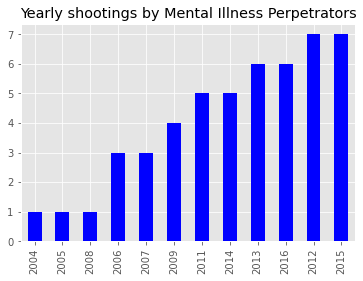
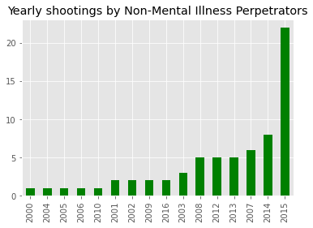
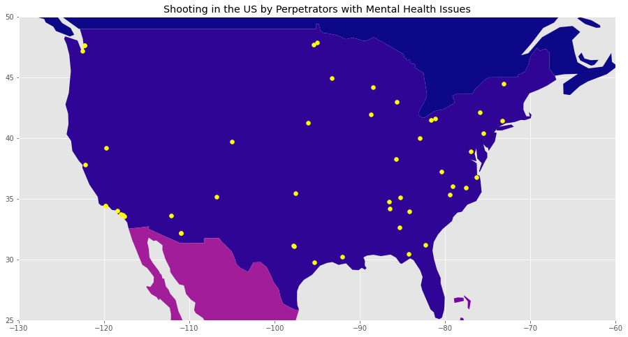
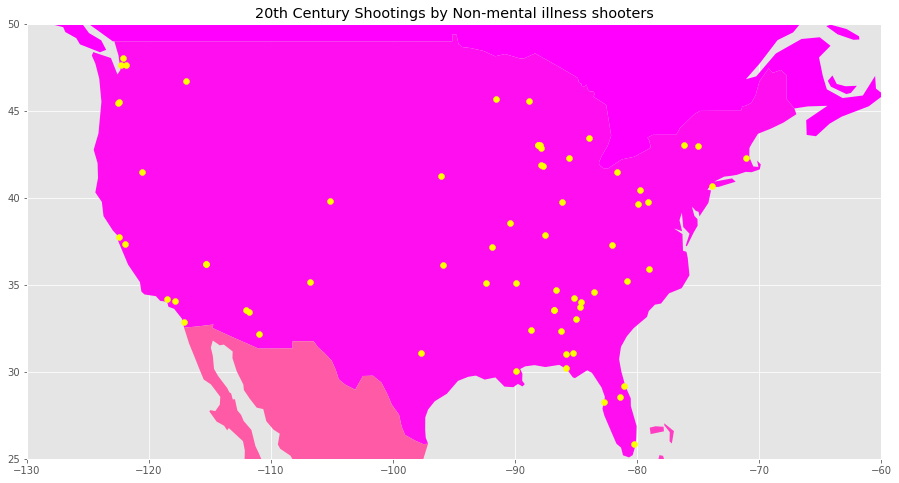
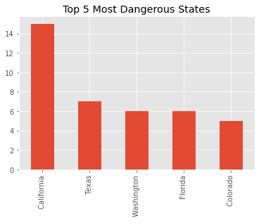
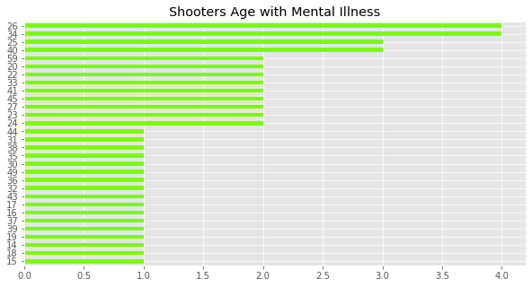
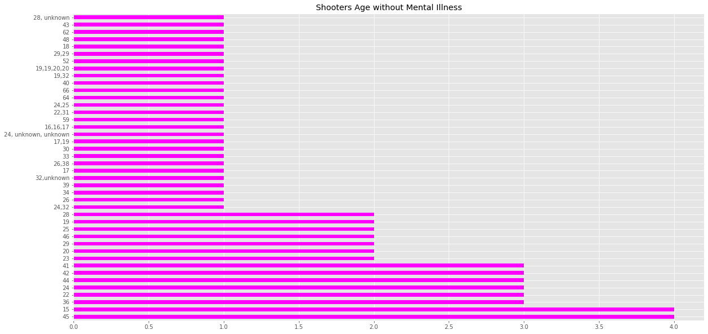
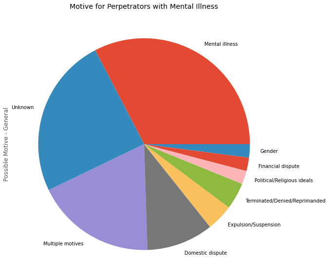
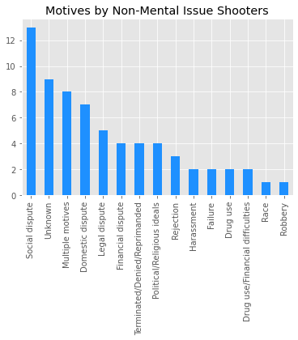
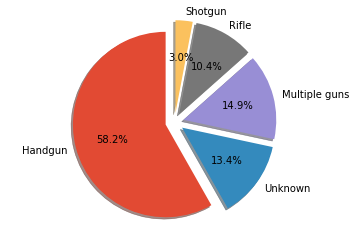

# US Mass Shootings Analysis

### Group Members: 
Alex Abdullah and Kelly Tran

# Motivation & Summary
<b>Hypothesis:</b> A greater number of mass shootings that occurred in the 20th century were driven by mental health issues than motivated by race.

The questions explored in this analysis were related to the drivers of the shooting as well as the unique attributes of the shooter and victims/fatalities involved. They played a key role in better understanding the key reasons why mass shootings in the US were occurring as well as where they were occurring most.

With the dataset used in the analysis, the questions were answered however could have been explored furthered with an overlay of other datasets about the prominance of mental illness in the US as well as the social and economic status of certain states in the US.

# Questions explored: 
1. Are there any relationships with attributes of the shooter - age, gender, mental health, race?
2. How frequent are mass shootings occurring in the US that are related to mental health vs not related to mental health?
3. Where and when are mass shootings occurring most? 
4. What are the weapons used by individuals with and without a mental illness?
6. Are there more victims involved when it is a mental health related shooting?

## Dataset used: 
----
The dataset was obtained from  [Kaggle.com](Kaggle.com) and [motherjones.com](https://www.motherjones.com/politics/2012/12/mass-shootings-mother-jones-full-data/).

After some data preparation such as dropping columns, renaming columns and removing null variables we have concluded to retaining the following datapoints from the dataset for the years 2000 and above.

<b><u> Note:</b></u>  For additional information on the data clean up and preparation process, refer to the notebook.

---------

### Additional points explored:
* Profiling shooters and victims involved 
* Profiling details of shootings - year, location (city/state), total shootings related to race vs mental illness 
* Total fatalities and total victims as a result of shootings that were mental health related

`Location`: Location where incident took place                              
`City`: City where shooting took place                                  
`State`: State where shooting took place                                 
`Latitude`: Latitude coordinate where shooting occurred                                
`Longitude`: Longitude coordinate where shooting occurred                              
`Total Number of Fatalities`: Number of fatalities as a result of shooting          
`Total Number of Victims`: Number of victims as a result of shooting including fatalities and those injured     
`Description`: Description of the incident                           
`Date`: Date of shooting                                                             
`Number of shooters`: Number of shooters involved                     
`Shooter Age(s)`: Age of shooter                         
`Shooter Sex`: Shooter gender                            
`Shooter Race`: Shooter's race                                              
`Type of Gun - General`: Type of gun used in the shooting                                    
`Total Number of Guns`: Total number of gun used in the shooting                    
`Fate of Shooter`: Shooters fate                         
`Shooter's Cause of Death`: Shooters cause of death              
`School Related`: Whether the shooting was school related                     
`Place Type`: Place type where the shooting took place                             
`Relationship to Incident Location`: Shooters relationship with the incident location                   
`Targeted Victim/s - General`; Type of victims involved           
`Possible Motive - Detailed`: Detailed description of motive              
`Possible Motive - General`: High level motive of shooting             
`History of Mental Illness - Detailed`: Description of shooters mental illness   
`History of Mental Illness - General`: Indication if shooter had a mental illness     

-------
## Data Analysis  
### The Numbers
* California had the highest number of recorded mass shootings (15)
  - As of 2021, the estimated population of California is 39.24 million making it the highest populated city in the US. 
  - This state also has the highest rate of homelessness with an over 150,000 homeless people
  - There appears to be a correlation between the population of a state and the number of mass shooting occurences at least in the top of each. Further analysis was not conducted on this exploration question as it was outside the scope of our study.
  
* The handgun was the most popular weapon used
  - Accessible and most affordable of the observed firearms (~$350 USD)
  - Additionally, The Gun Control Act of 1968 (GCA), which regulates firearms at the federal level, requires that citizens and legal residents must be at least 18 years of age to purchase shotguns or rifles and ammunition. All other firearms — handguns, for example — can only be sold to people 21 and older
  
* Over 98% of shootings were commited by a male perpetrator
  - This could be part of a whole separate analysis. Males generally tend to exhibit more violent tendencies than women.
  - Approximately 81% of crimes in the US are committed by males.
  
* The average shooter age was ~33 years old
  - Shootings were committed by perpetrators anywhere from 15 to 59 years of age.
  - Mental Illness shooters -> 26 & 34 years of age
  - Without Mental Illness -> 15 & 45 years of age
  
* The most commonly occurring motive for shootings in our analysis was domestic disputes. 
  
* Mental Illness occurred far more frequently as a motive versus Race
  - We must note that mental illness included any diagonoses ranging from depression to psychosis. Further study could be made to explore which diagnoses correlated with the largest number of shootings.

### Challenges
  - Limited datasets available. Difficulty was encountered locating useful information containing information pertaining to key variables such as mental illness record and race. 
  - Due to time constraints, we were unable to conduct additional research to integrate supporting findings into our exploration. Vast majority of our time was spent exploring the datasets we had available
-----
## Shootings Per Year
* Top 3 years with the highest number of shootings by perpetrators with a mental illness were in 2012, 2015 and 2016. 

* Interestingly, the most shootings that took place where the perpetrator didn't suffer from a mental illness were in 2007, 2014, and 2015. 

* <b><u>Comments</u></b>:
With additional time, we could have resarched as to why this may have been the case such as whether there is a correlation between the increase in mental health in recent years vs previously.
-----
## Shooting Occurances Across the US
These incidents occured most in California as well as the east coast of the United States. 

 

Top 5 states where shootings occured most. 

------
# Perpetrator Age Distribution
Below are the age distrubiton of the perpetrators with and without a mental illness.

--------
# Motive 
* For perpetrators with a mental illness, their primary motive was due to their mental health. However, for those without a mental health, the primary known motive were due to social disputes. 

-------- 
# Victims Involved 

# Weapons Used 
* Weapons used by perpetrators.
